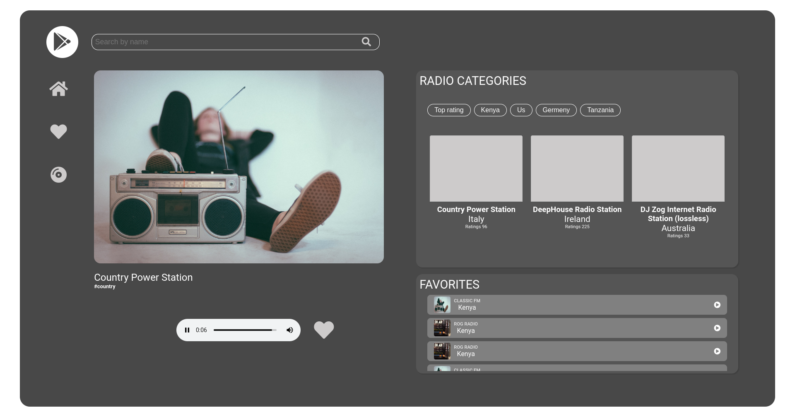

# Sauti

## Project Description
 
 This is a radio app, can use to listen to any radio station from the world.  

***

### Authors  
* Bukosia Ebenezar
* Mourice Nganga
* Bonface Masira

***

### Screenshot

#### 

---
## Figma link

https://www.figma.com/file/hvyIz8A7MR433feejIqaVh/radio?node-id=0%3A1

# Figma design

### https://www.figma.com/file/wVhKPeexcomTHjNPxt2nps/clock-me?node-id=0%3A1
***
## Table of content

- [Technologies](#description)
- [Description](#description)
- [Features](#features)
- [Setup-process](#setup_process)
- [Project-usage](#project-usage)
- [Licence](#licence)
- [Copyright](#copyright)

---

## Technologies

languages used are:

- HTML :HTML5 -which is used to create the structure of thr page
- CSS :CSS4 -used to style the page
- JavaScript:ES6 -used to code app backend and front end

---

### Features

As a user you ase able to:
1. play any radio station
2. filter radio stations by either country location or ratings
2. search for any radio station

---

### description

This is a radio app, can use to listen to any radio station from the world. api.radio.browser api has been used to get all the radio stations info and stream url.  

---

### challenges

---

## How to set up and run the project

### Requirements

- [npm](https://www.npmjs.com/)
- Text editor eg [Visual Studio Code](https://code.visualstudio.com/download)

---

## Dependencies

- npm

---

#### setup

clone the repo using the command

- $git clone https://github.com/Ebenezr/sauti.git
- change into directory using command
- `$cd sauti`
- open the code in vs code with command
- `code .`
- use live server to run the front end
- pick any radio station from category section and play.

---
#### Live link

https://ebenezr.github.io/Sauti/

***

## How to use the project

The project root folder contains two files, main **index.html** and **README.md** file and one folder assets folder. the assets folder within it are four folders **css** which contains css files and **images** folder which contains images, **JS** which contains JavaScript files.
---

### Contributing to project

- Fork the repo

* Create a new branch in your terminal (git checkout -b improve-feature)
* Install the prerequisites
* Make appropriate changes in file(s)
* Run the server to see the changes
* Add the changes and commit them (git commit -am "Improve App")
* Push to the branch (git push origin improve-app)
* Create a Pull request

---

## Copyright

Copyright(c)[2022]

---

## Contact Information

- Ebenezar : ebenezarbukosia@gmail.om
- Moryno :
- Bonface : 

---

## [License](LICENSE)

MIT License
Copyright (c) 2022